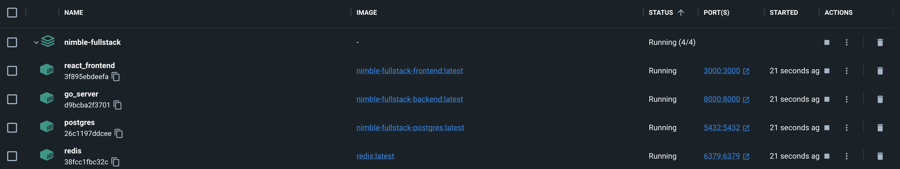
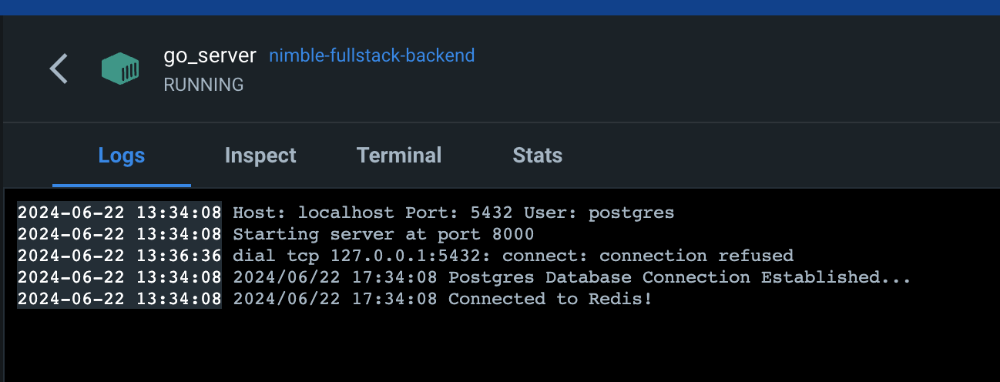

# Chat Web Application 

### Screen Capture
[Demo Video Link](https://www.loom.com/share/b3d9b042ea4c49c39cb618ec5fb50824?sid=ea75bb90-d2e0-4dce-adb4-45a493d4a4fb)




### Overview
This project is a full-stack web application with a Golang backend, a React TypeScript frontend, PostgreSQL for data storage, and Redis for upvote/downvote functionality.
#### Frontend Framework: React Typescript
- User authentication
- Real-time messaging
- Upvote/downvote functionality
- Responsive chat interface

#### Backend Framework: Go
- RESTful API for fetching historical message data
- Websockets for real-time messaging
- User authentication
- Vote handling with Redis

#### Protocol
- RESTful API: Used for fetching historical data and user authentication.
- Websockets: Used for real-time messaging and vote updates.

#### Storage
- PostgreSQL: Used for storing usernames, passwords, and messages.
- Redis: Used for handling upvote and downvote counters.

### Project Structure
```text
Nimble-FullStack/
│
├── golang/
│   ├── Dockerfile.backend
│   ├── go.mod
│   ├── go.sum
│   ├── server.go
│   ├── .env
│   └── ... other directories and files
│   
├── react-typescript/
│   ├── Dockerfile.frontend
│   ├── package.json
│   ├── package-lock.json
│   └── src/
│       ├── index.tsx
│       └── ... other files
│
├── postgres-init/
│   └── init.sql
│
├── Dockerfile.postgres
└── docker-compose.yml
```


### Build and Start the Services
```bash
docker-compose up --build
```
This command will build the Docker images and start the containers for the backend, frontend, PostgreSQL, and Redis.

### Running the Application
You can access your application at:
- Frontend: http://localhost:3000
- Backend: http://localhost:8000

---
I follow these steps to test my backend, db and frontend setup using Docker.
#### Test and run DB locally
First, set up `redis` and `postgres` using docker commands:
```bash
docker-compose up -d postgres
```
```bash
docker-compose up -d redis
```
Test PostgreSQL and Redis
```bash
docker exec -it $(docker ps -qf "name=postgres") psql -U postgres -d nimble_chat
```
```bash
docker exec -it $(docker ps -qf "name=redis") redis-cli
```
Inside the PostgreSQL shell:
```bash
\dt
SELECT * FROM user;
```

### Test and run backend locally 
Navigate to the backend `golang` directory:
```bash
go run server.go
```
Test backend docker image:
```bash
docker-compose up -d backend
```
### Test and run frontend locally
Navigate to the frontend `react-typescript` directory:
```bash
npm start
```
Test frontend docker image:
```bash
docker-compose up -d frontend
```

### Minikube
Start minikube
```shell start
minikube
```
Build and Push Docker Images to Minikube:
```shell
eval $(minikube -p minikube docker-env)
docker build -t backend-image:latest -f golang/Dockerfile.backend golang/
docker build -t frontend-image:latest -f react-typescript/Dockerfile.frontend react-typescript/
```
Deploy PostgreSQL and Redis:
```shell
kubectl apply -f k8s/deployment-postgres.yaml
kubectl apply -f k8s/service-postgres.yaml

kubectl apply -f k8s/deployment-redis.yaml.yaml
kubectl apply -f k8s/service-redis.yaml
```
Deploy Backend and Frontend:
```shell
kubectl apply -f k8s/deployment-backend.yaml
kubectl apply -f k8s/service-backend.yaml

kubectl apply -f k8s/deployment-frontend.yaml
kubectl apply -f k8s/service-frontend.yaml
```
Accessing the Application:
```shell
minikube service frontend-service
```